# ЕКЗАМЕНАЦІЙНА РОБОТА (Скріншоти результатів нижче)

## Тема: Завершення Blockchain-проєкту: P2P-мережа, синхронізація та консенсус.

**Час виконання:** 2 години. Максимальна оцінка: 12 балів.

**Мета роботи:** протягом курсу ви створили власний Blockchain, який уже підтримує транзакції, цифровий підпис, гаманці та баланси, Mempool, комісії, винагороду майнера, Halving, Proof of Work, Difficulty, перевірку цілісності Blockchain та збереження даних. На екзамені необхідно завершити систему та перетворити її з локальної програми на просту розподілену Blockchain-мережу, у якій незалежні ноди можуть обмінюватися транзакціями та блоками, синхронізувати історію та приходити до спільного стану. Використовуйте власний проєкт, створений протягом курсу.

## ✅ Завдання 1: Дві незалежні ноди (1 бал)

Програма повинна дозволяти одночасно запустити щонайменше дві незалежні ноди, наприклад Node A та Node B. Кожна нода повинна мати власний Blockchain, власний Mempool, власний мережевий порт та однаковий Genesis Block. Ноди повинні працювати як окремі процеси, а не як два об’єкти всередині однієї програми.

У консолі повинно бути зрозуміло, яка саме нода запущена, на якому порту вона працює, скільки блоків знаходиться у її Blockchain та скільки транзакцій зараз знаходиться у Mempool.

## ✅ Завдання 2: Зручне керування нодою (1 бал)

Додайте зрозуміле консольне меню для роботи з нодою. Користувач повинен мати можливість переглянути Blockchain, переглянути Mempool, створити транзакцію, змайнити блок, відправити транзакцію іншій ноді, відправити блок, запустити синхронізацію Blockchain та переглянути поточний стан ноди.

У статусі ноди бажано показувати назву ноди, порт, кількість блоків, Hash останнього блока, кількість транзакцій у Mempool та поточний Difficulty. Назви та номери пунктів меню студент може обрати самостійно.

## ✅ Завдання 3: Передача транзакцій між нодами (2 бали)

Транзакція, створена на Node A, повинна мати можливість передаватися Node B через мережу. Node B не повинна автоматично довіряти отриманій транзакції та одразу додавати її до Mempool.

Перед додаванням отриманої транзакції необхідно виконати стандартну перевірку транзакції, яка вже була реалізована у проєкті. Необхідно перевірити коректність даних, цифровий підпис, наявність необхідних полів та відсутність дубліката. Якщо транзакція вже знаходиться у Mempool або вже була включена до Blockchain, повторно додавати її не можна.

Під час демонстрації необхідно показати, що до передачі на Node A знаходиться одна транзакція у Mempool, а на Node B її немає. Після мережевої передачі ця сама транзакція повинна з’явитися у Mempool Node B. Id транзакції на обох нодах повинен бути однаковим.

## ✅ Завдання 4: Передача нового блока (2 бали)

Node A повинна мати можливість змайнити новий блок та передати його Node B через мережу. Node B не має права просто додати отриманий блок до Chain без перевірки.

Перед прийняттям блока необхідно перевірити його Index, PrevHash, правильність Hash, відповідність Proof of Work, Difficulty та відсутність такого самого блока у локальному Blockchain. Якщо хоча б одна перевірка не пройдена, блок повинен бути відхилений.

Після успішного прийняття блока транзакції, які знаходилися у локальному Mempool та вже потрапили до отриманого блока, повинні бути видалені з Mempool.

Під час демонстрації необхідно показати ситуацію, коли Node A має, наприклад, три блоки, а Node B — два. Node A передає останній блок Node B. Після успішної перевірки Node B також повинна мати три блоки. Hash останнього блока на Node A та Node B повинен збігатися.

## ✅ Завдання 5: Виявлення відставання ноди (1 бал)

Створіть ситуацію, коли Node A має ланцюг Genesis → Block 1 → Block 2 → Block 3, а Node B має лише Genesis → Block 1.

Якщо Node A намагається передати Node B одразу Block 3, Node B не повинна приймати його, оскільки їй не вистачає Block 2 і PrevHash не відповідає локальному останньому блоку.

Система повинна визначити, що локальна нода відстає, відхилити блок та повідомити користувача про необхідність синхронізації. При цьому локальний Blockchain Node B не повинен бути пошкоджений або частково змінений.

## ✅ Завдання 6: Синхронізація Blockchain (2 бали)

Додайте окрему можливість синхронізації Blockchain між нодами. Node B повинна мати можливість отримати повний Blockchain Node A.

Отриманий Chain не можна просто скопіювати без перевірки. Спочатку необхідно перевірити його цілісність за допомогою вже реалізованої логіки валідації Blockchain, після чого порівняти отриманий ланцюг із локальним.

Якщо отриманий Blockchain невалідний, він повинен бути відхилений. Якщо він коротший за локальний, локальний Blockchain залишається без змін. Якщо довжина однакова, локальний Blockchain також можна залишити без змін. Якщо отриманий Blockchain довший і при цьому повністю валідний, нода повинна прийняти його як актуальну версію історії.

У межах цієї навчальної роботи дозволяється використовувати спрощене правило: довший валідний Blockchain вважається актуальним.

Під час демонстрації необхідно показати, що, наприклад, Node A має п’ять блоків, а Node B лише два. Після запуску синхронізації Node B отримує Blockchain Node A, перевіряє його та приймає. У результаті обидві ноди повинні мати однакову кількість блоків та однаковий Hash останнього блока.

## ✅ Завдання 7: Fork та спрощений Nakamoto Consensus (1 бал)

Необхідно показати або реалізувати обробку ситуації, коли дві ноди мають спільну історію, але створили різні блоки однакової висоти.

Наприклад, Node A має Genesis → Block 1 → Block 2A, а Node B має Genesis → Block 1 → Block 2B. Block 2A та Block 2B можуть бути повністю валідними. Це не обов’язково означає атаку, оскільки два майнери можуть майже одночасно знайти різні валідні блоки.

Далі одна з гілок повинна продовжитися, наприклад Node A створює Block 3A і отримує ланцюг Genesis → Block 1 → Block 2A → Block 3A. Після синхронізації Node B повинна перейти на довший валідний Blockchain.

На захисті студент повинен пояснити, що таке Fork, чому дві різні версії блока однакової висоти можуть виникнути природним шляхом, чому різні ноди можуть тимчасово бачити різну історію та як мережа поступово приходить до спільного стану.

У реальних Proof-of-Work мережах правильніше використовувати не просто кількість блоків, а накопичену роботу — cumulative Proof of Work. У межах цієї роботи дозволяється спрощений варіант із вибором довшого валідного ланцюга.

## ✅ Завдання 8: Merkle Tree (додаткове завдання для отримання максимальної оцінки)

Для отримання 12 балів необхідно реалізувати Merkle Tree для транзакцій блока.

У модель Block потрібно додати поле MerkleRoot. Замість прямого об’єднання всіх транзакцій під час формування Hash блока необхідно спочатку обчислити Hash кожної транзакції, потім попарно об’єднувати отримані Hash та знову хешувати результат. Процес повторюється доти, доки не залишиться одне фінальне значення — MerkleRoot.

Якщо на певному рівні кількість Hash непарна, дозволяється дублювати останній Hash.

MerkleRoot повинен зберігатися у Block та брати участь у формуванні Hash самого блока. Після зміни будь-яких даних хоча б однієї транзакції повинен змінитися її Hash, після цього MerkleRoot, а в результаті і Hash самого блока.

На захисті студент повинен пояснити, що таке Merkle Tree та Merkle Root, чому зміна однієї транзакції змінює MerkleRoot і яку перевагу така структура дає Blockchain при роботі з великою кількістю транзакцій.

## Обов’язкова фінальна демонстрація.

У результаті роботи студент повинен показати повний сценарій: створення транзакції на одній ноді, додавання її до Mempool, передача транзакції іншій ноді, перевірка транзакції іншою нодою, майнінг нового блока, передача блока через мережу, перевірка блока іншою нодою, ситуація з відставанням однієї ноди та подальша синхронізація Blockchain.

Після завершення синхронізації Node A та Node B повинні мати однакову кількість блоків і однаковий Hash останнього блока.

## Що потрібно здати.

Студент повинен прикріпити посилання на GitHub-репозиторій із повним проєктом та скріншоти, які підтверджують роботу реалізованого функціоналу.

Обов’язково необхідно надати скріншот двох одночасно запущених нод, скріншот передачі транзакції між нодами, скріншот передачі та успішного прийняття блока, скріншот ситуації з відставанням ноди та скріншот успішної синхронізації, де видно однакову кількість блоків і однаковий Hash останнього блока на обох нодах.

Для завдання з Fork необхідно додатково показати різні гілки Blockchain до синхронізації та результат після вибору актуального ланцюга. Для Merkle Tree необхідно показати реалізацію та результат роботи MerkleRoot.

## Скріншоти результатів

### Дві одночасно запущені ноди

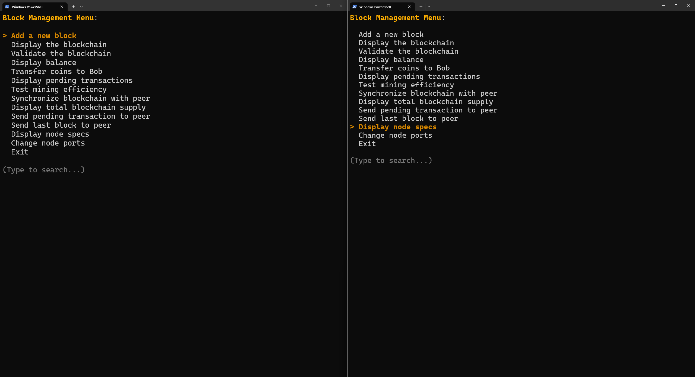

### Передача транзакції з помилкою тому що на іншій ноді не існує доки коштів на цю транзакцію

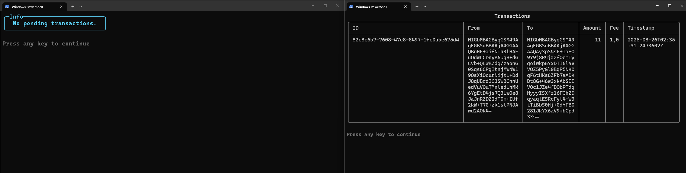

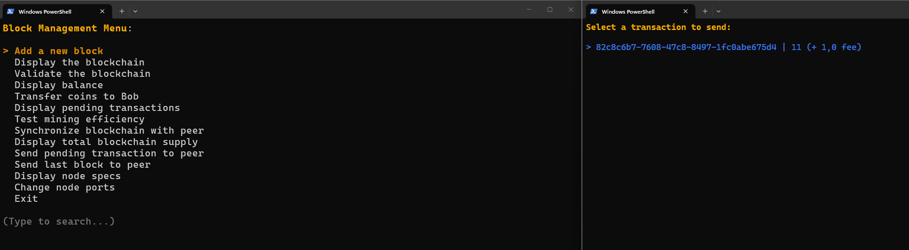

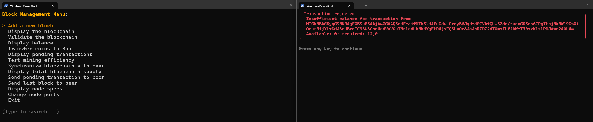

### Передача блока для виправлення цієї помилки

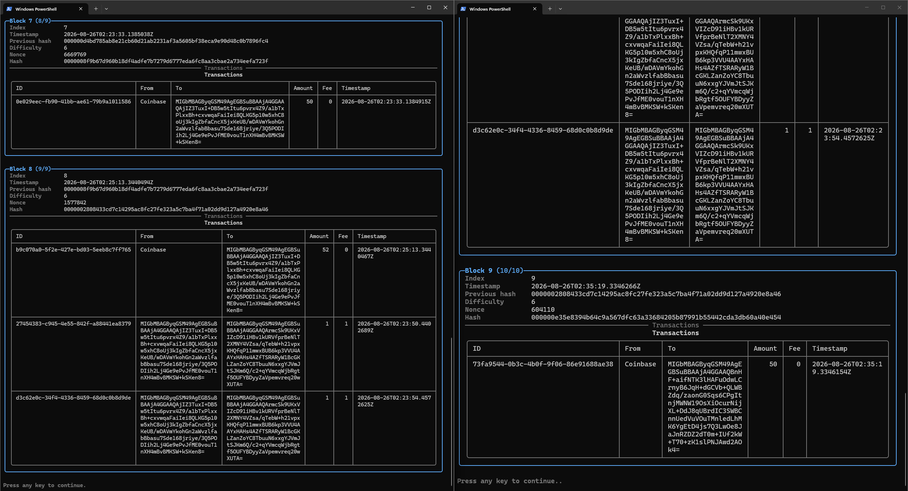

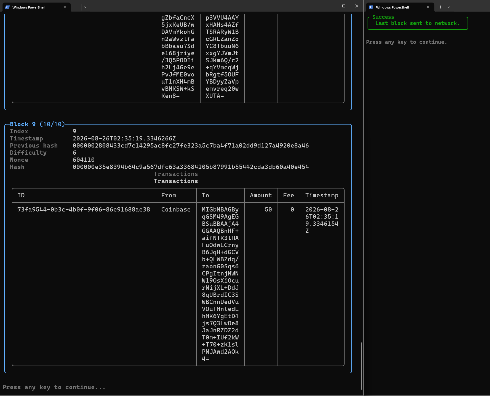

### Передача транзакції без помилки

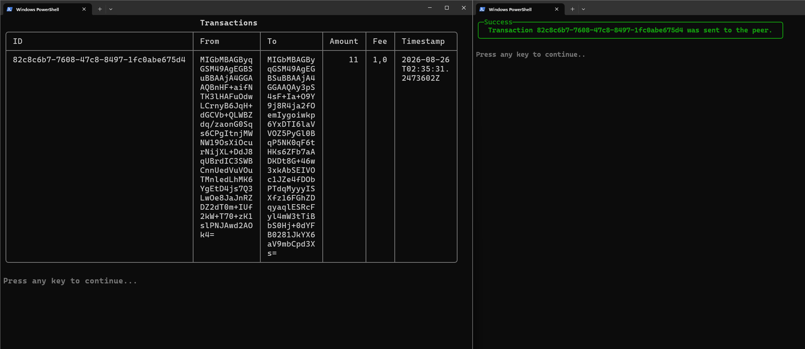

### Синхронізація блоків

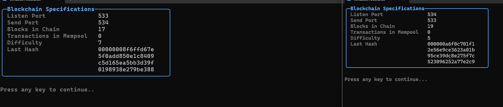

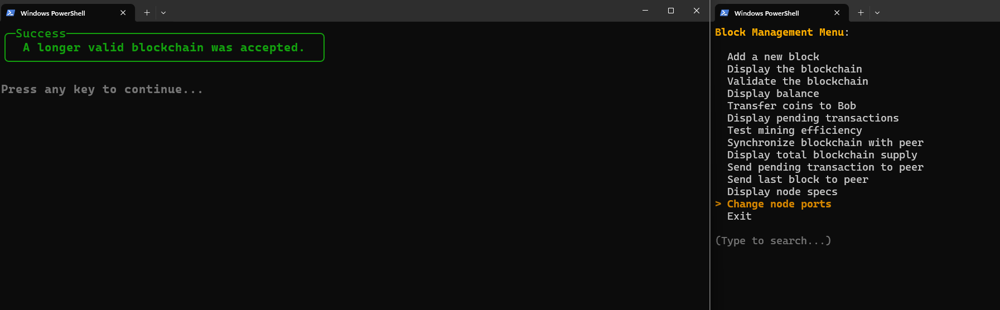

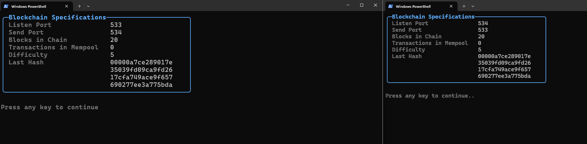

### Fork (На останьому скріні видно як історія змінилась)

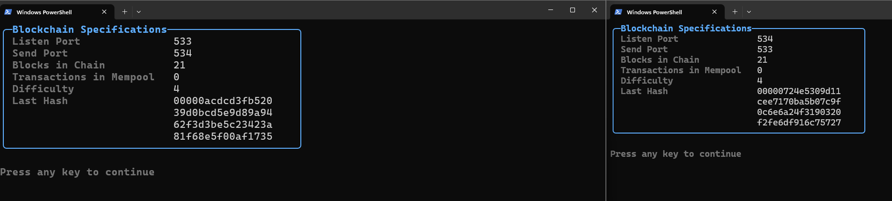

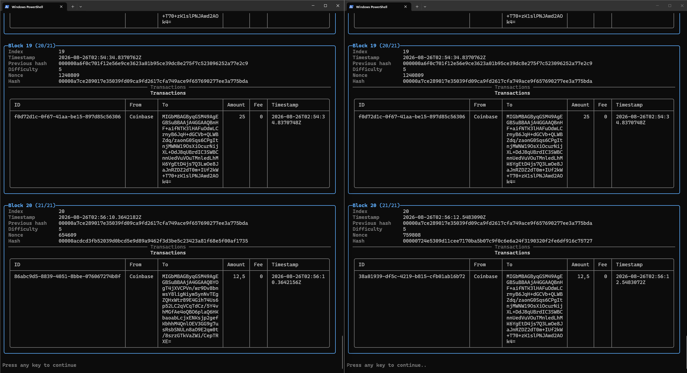

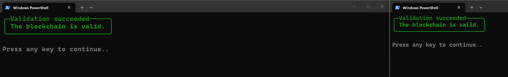

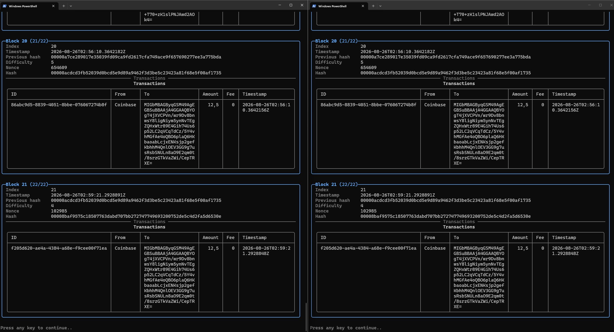

### Дерево Меркла (як результат показав поле в файлі збереженного ланцюга)

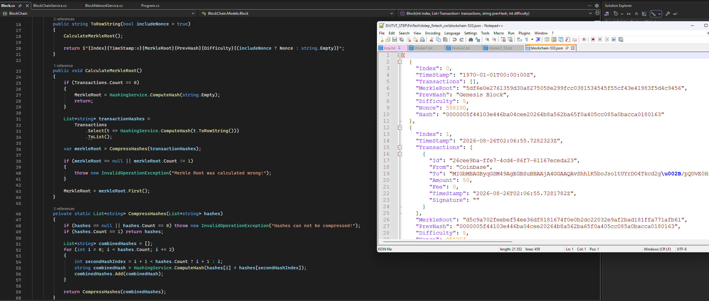

## Whiteboard

